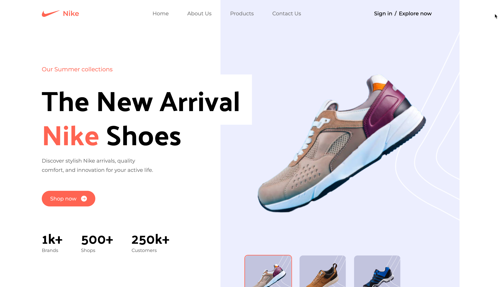

# Nike Clone Landing Page



This project is a Nike clone landing page created as a part of the Multiverse Deployment Bootcamp project. The landing page is built using Tailwind CSS, React, Vite, JavaScript, HTML, and Node.js. It has been deployed using Hostinger.

## Table of Contents

- [Demo](#demo)
- [Features](#features)
- [Technologies Used](#technologies-used)
- [Installation](#installation)
- [Deployment](#deployment)

## Demo

You can view the live demo of the Nike clone landing page [here](https://rb-3d-tshirt.shop/).

## Features

- Responsive design, adapting to various screen sizes and devices.
- Home page showcasing Nike products with stunning visuals.
- Interactive elements and animations for an engaging user experience.

## Technologies Used

- Tailwind CSS: A utility-first CSS framework for styling.
- React: A JavaScript library for building user interfaces.
- Vite: A fast-build tool for modern web applications.
- JavaScript: The programming language used for dynamic functionality.
- HTML: The markup language for structuring the web page.
- Node.js: A JavaScript runtime used for server-side scripting.

## Installation

To get the Nike Clone Landing Page up and running locally, follow these steps:

1. **Clone the repository:**

    ```bash
    git clone https://github.com/your-username/nike-clone.git
    ```

2. **Install the required dependencies:**

    ```bash
    cd nike-clone
    npm install
    ```

3. **Start the development server:**

    ```bash
    npm run dev
    ```

After completing these steps, you should have the development server running and be able to access the landing page by opening your web browser and navigating to `http://localhost:3000`.

## Deployment

To deploy the project using Hostinger:

1. Build the project:

      ```bash
    npm run build
    ```

2. Upload the contents of the dist directory to your Hostinger hosting account.

3. Configure your domain to point to the Hostinger server.

4. Your Nike clone landing page should now be accessible through your domain.
